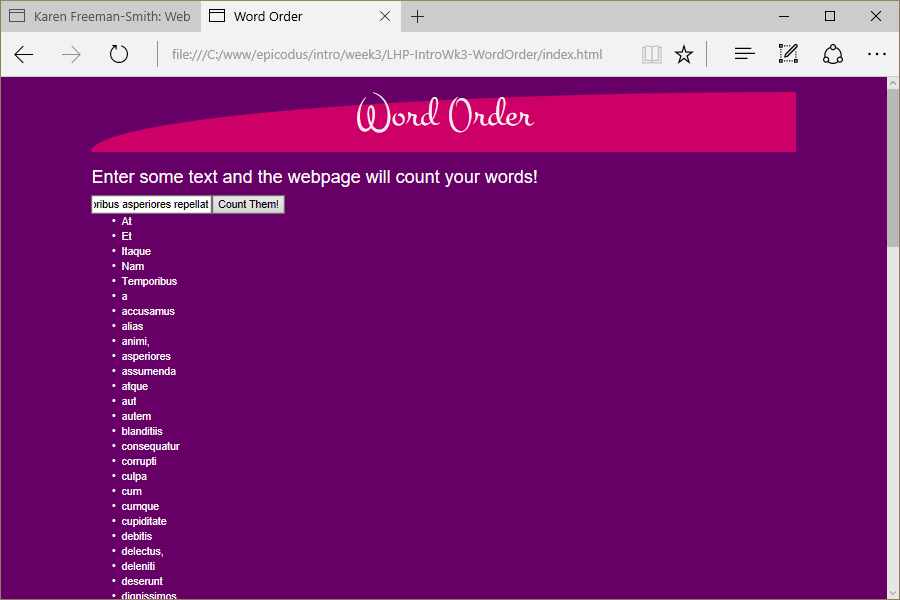

# Word Order
Version 0.0.1: April 25, 2016
by [Karen Freeman-Smith](https://karenfreemansmith.github.io)

### Technologies Used
HTML, CSS, Bootstrap, JavaScript, jQuery

## Description
*[Learn How To Program](http://learnhowtoprogram.com) Intro to Programming Week 2 Individual Project: A website that counts the number of times a word occurs and sorts words in order of popularity.*

## Setup/Installation
* [View on Github Pages](https://karenfreemansmith.github.io/LHP-IntroWk3-WordOrder)
* _OR_
* Clone directory
* Open index.html in your favorite browser

## Support & Contact
For questions, concerns, or suggestions please email karenfreemansmith@gmail.com

### Specifications
* Website allows user to input a block of text.
* Website prints out a list of all the unique words from the text.
* Order the list by the number of appearances - greatest to least.
* For words that appear the same amount of times, order by which word appeared first.

## Known Issues
* Words are not sorting by popularity yet.

## Legal
*Licensed under the GNU General Public License v3.0*

Copyright (c) 2016 Copyright _[Karen Freeman-Smith](https://karenfreemansmith.github.io)_ All Rights Reserved.
